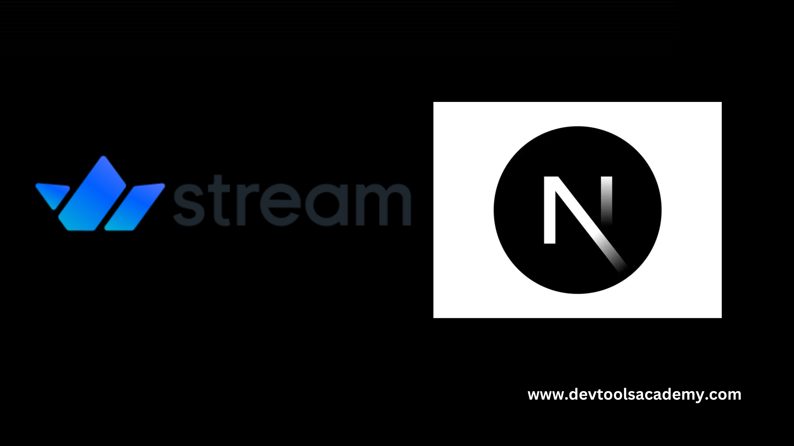
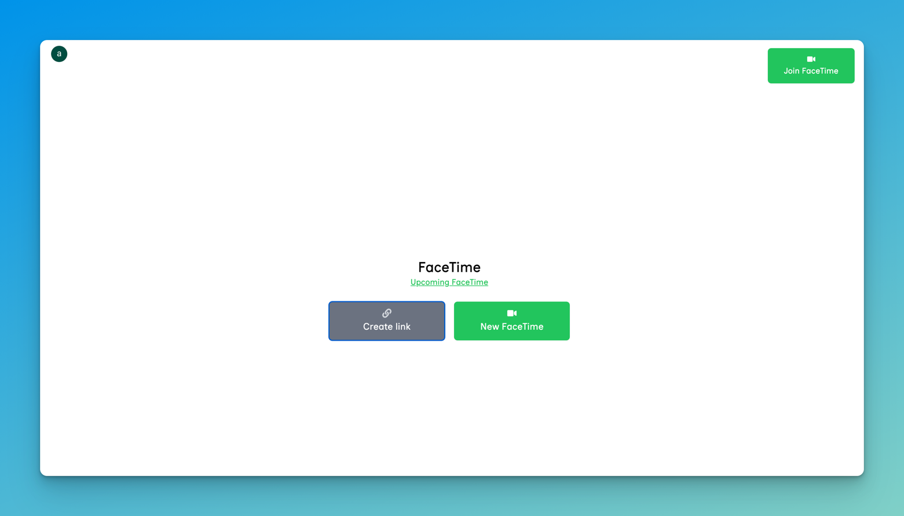

# 🚀 FaceTime with Stream

Welcome to FaceTime, a video communication app powered by GetStream.io.



## Demo



Check out the live demo [here](https://facetime-on-stream.vercel.app/).

## 🌟 Key Features

- **Real-time Video Communication**: Powered by GetStream.io for smooth, high-quality video calls.
- **Instant Meetings**: Create on-the-fly video sessions with a single click.
- **Scheduled Calls**: Plan ahead with our calendar integration.
- **Shareable Links**: Generate and share meeting links easily.

## 📋 Prerequisites

Before you begin, ensure you have the following:

- Node.js (v14.x or higher)
- npm (usually comes with Node.js)
- [Clerk](https://clerk.com/) account for auth
- [GetStream.io](https://getstream.io/) account for video streaming

## 🚀 Getting Started

Follow these steps to set up the project locally:

### 1. Clone the Repository

```bash
git clone https://github.com/your-username/face-time-on-stream.git
cd face-time-on-stream
```

### 2. Install Dependencies

```bash
npm install
```

### 3. Set Up Environment Variables

Create a `.env.local` file in the root directory and add the following:

```env
# Clerk Authentication
NEXT_PUBLIC_CLERK_PUBLISHABLE_KEY=your_clerk_publishable_key
CLERK_SECRET_KEY=your_clerk_secret_key

# GetStream.io
STREAM_APP_ID=your_stream_app_id
NEXT_PUBLIC_STREAM_API_KEY=your_stream_api_key
STREAM_SECRET_KEY=your_stream_secret_key

# App Configuration
NEXT_PUBLIC_FACETIME_HOST=http://localhost:3000/facetime
```

Replace the placeholder values with your actual credentials.

### 4. Run the Development Server

```bash
npm run dev
```

Your app should now be running at [http://localhost:3000](http://localhost:3000).

## 🛠 Project Structure

```
face-time-on-stream/
│
├── src/
│   ├── app/
│   │   ├── modals/
│   │   │   ├── CreateLink.tsx
│   │   │   ├── InstantMeeting.tsx
│   │   │   ├── JoinMeeting.tsx
│   │   │   └── UpcomingMeeting.tsx
│   │   │
│   │   ├── layout.tsx
│   │   └── page.tsx
│   │
│   ├── hooks/
│   │   └── []
│   │
│   └── lib/
│       └── [util.ts]
│
├── public/
│   └── stream-logo.png
│
├── .env.local
├── next.config.js
├── package.json
└── README.md
```

## 📚 API Reference

### Clerk Authentication

I use Clerk for user auth. [Learn more about Clerk's API](https://clerk.com/docs/reference/clerkjs).

### GetStream.io Video

All video calls are powered by GetStream.io. [Explore GetStream's video API](https://getstream.io/video/docs/).


## 🙏 Acknowledgements

- [GetStream.io](https://getstream.io/) for their excellent video streaming platform.
---

Built with ❤️ by [Ankur Tyagi](https://theankurtyagi.com/)