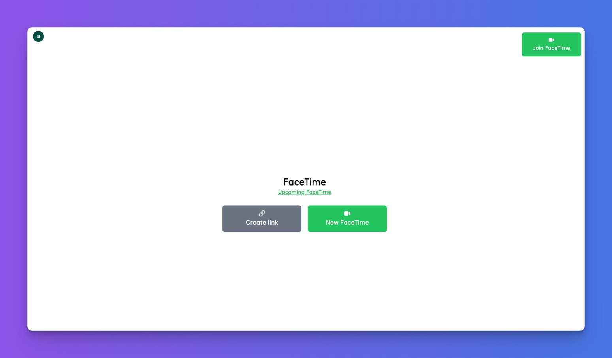

import { CodeBlock } from '@components/CodeBlock'

## 🚀 Getting Started with FaceTime Clone

Welcome to FaceTime app clone. Follow these steps to set up the project and get it running locally.

### Prerequisites
Before you begin, make sure you have:

- **Node.js** installed (at least v14.x or higher).
- A [Clerk](https://clerk.com/) account for user authentication.
- A [GetStream.io](https://getstream.io/) account for real-time functionalities.

### Step 1: Clone the Repository
First, clone the project to your local machine:

<CodeBlock>
  {`git clone https://github.com/your-repo/face-time-clone.git
  cd face-time-clone`}
</CodeBlock>

### Step 2: Install Dependencies
Use the package manager `npm` to install all necessary dependencies:

<CodeBlock>
  {`npm install`}
</CodeBlock>

### Step 3: Set up Authentication (Clerk)
Create a [Clerk](https://clerk.com/) account and copy your API credentials into a **`.env.local`** file:

<CodeBlock>
  {`NEXT_PUBLIC_CLERK_PUBLISHABLE_KEY=your-clerk-publishable-key
CLERK_SECRET_KEY=your-clerk-secret-key`}
</CodeBlock>

### Step 4: Set up Real-time Streaming (GetStream.io)
Create a [GetStream.io](https://getstream.io/) account and retrieve your API credentials. Add them to the same **`.env.local`** file:

<CodeBlock>
  {`STREAM_APP_ID=your-stream-app-id
NEXT_PUBLIC_STREAM_API_KEY=your-stream-api-key
STREAM_SECRET_KEY=your-stream-secret-key`}
</CodeBlock>

### Step 5: Add Environment Variables
Add this environment variable to your **`.env.local`** file to configure the app’s hosting environment:

<CodeBlock>
  {`NEXT_PUBLIC_FACETIME_HOST=http://localhost:3000/facetime`}
</CodeBlock>

### Step 6: Start the Development Server
Finally, run the development server with the following command:

<CodeBlock>
  {`npm run dev`}
</CodeBlock>

Your FaceTime clone should now be up and running at [http://localhost:3000](http://localhost:3000).

---

## 🎯 Key Features

- Real-time video communication using GetStream.
- User authentication and management via Clerk.
- Simple and clean UI, making it easy to create and join video calls.

---

